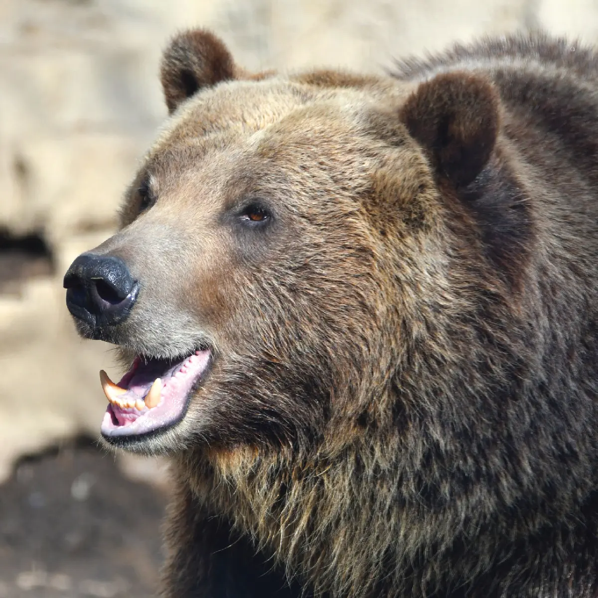
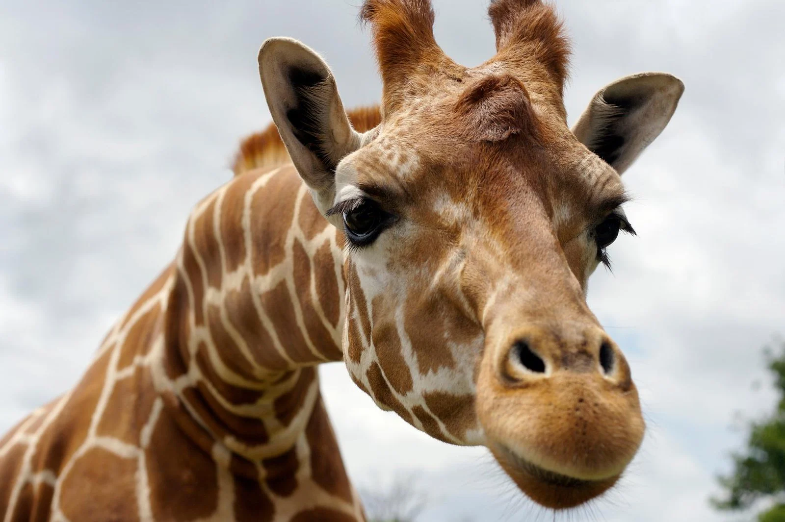

# Block-5-Workshop--Zoo-Animals-Page
To build a build a page that will make it easier for the new interns to identify each animal and understand their needs and behaviors. This is a way for our instructors to know that we are building on our skills. 

<!DOCTYPE html>
<html lang="en">
    <This site will build a page that will make it easier for the new interns to identify each animal and understand their needs and behaviors.>

</head>
<body>
		

		<!-- Headings -->
		<h1>Zoo Animals</h1
			 
		<h2>1. Bears</h2>
        <!-- Image -->
			
            
Bears are solitary by nature, except when in family groups of mothers and cubs or in pairs during the mating season.

            
Bears may congregate in areas of high food density, such as oak stands, berry patches, or farm fields. When abundant food sources are found across large areas, bears tend to tolerate each other more than usual, mostly because they cannot defend such a rich food source from competitors.

            <!-- List -->
		<ol>
			<li>Ollie</li>
			<li>Mona</li>
		</ol>
         
		<a href="https://myfwc.com/wildlifehabitats/wildlife/bear/facts/behavior/#:~:text=Bears%20are%20solitary%20by%20nature,berry%20patches%2C%20or%20farm%20fields.">Bear Facts (link)</a>
		 
		<h2>2. Giraffes</h2>
        
        
The giraffe in South Africa live entirely in the Eastern Transvaal, a lowveld region primarily of grass or veld with scattered bushes and low trees. The giraffe browse on a wide variety of trees in the spring and fall when few leaves are available, but in summer when all the trees are in foliage they are much more selective. The giraffe spend most of the day and part of the night feeding, especially the early morning and late afternoon. In the summer when food is abundant, the giraffe have more time during the day to chew their cud and lie down.

		<!-- List -->
		<ol>
			<li>Frankie</li>
			<li>Coconut</li>
		</ol>
         
		<a href="https://ielc.libguides.com/sdzg/factsheets/giraffes/behavior">Giraffe Facts(link)</a>
		 
        <h2>3. Lions</h2>
        
        
Lions are highly territorial and occupy the same area for generations. Females actively defend their territories against other females, while resident males protect prides from rival coalitions. Territory size depends on prey abundance, as well as access to water and denning sites.

		<!-- List -->
		<ol>
			<li>Mella</li>
			<li>Karl</li>
		</ol>
         
		<a href="https://cbs.umn.edu/lion-research-center/all-about-lions/social-behavior#:~:text=Lions%20are%20highly%20territorial%20and,to%20water%20and%20denning%20sites.">Lion Facts (link)</a>
		 
        <h2>4. Monkeys</h2>
        
        
Like us, monkeys form strong friendships and bitter rivalries. They fight for each other and take care of one another. And the leader of a monkey troop, when deposed, will even exhibit signs of depression. When we watch their behavior we get the sense that their emotional lives may share something in common with our own.

		<!-- List -->
		<ol>
			<li>Cookie</li>
			<li>Earl</li>
            <li>Banana Pudding</li>
		</ol>
         
		<a href="https://www.pbs.org/wnet/nature/clever-monkeys-monkeys-and-emotion/4244/#:~:text=Like%20us%2C%20monkeys%20form%20strong,even%20exhibit%20signs%20of%20depression.">Monkey Facts (link)</a>
		 
        <h2>5. Alligators</h2>
		<!-- List -->
        
        
American alligators are large crocodilians found only in the United States. They can grow to be more than 12 feet (3.6 meters) in length and weigh as much as 1,000 pounds (450 kilograms), with males being slightly larger than females on average. The animal’s dark skin is armored with small, bony scales called scutes.

		<ol>
			<li>Wren</li>
			<li>Aspen</li>
            <li>Mika </li>
		</ol>
		 
		<a href="https://www.nwf.org/Educational-Resources/Wildlife-Guide/Reptiles/American-Alligator">Alligator Facts (link)</a>
		 
	</body>
</html>
</html>
